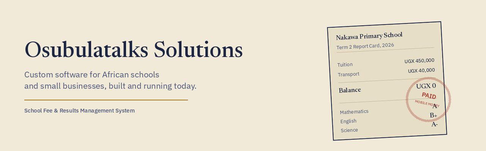

## What I build

I design and build practical, working systems, not templates or demos. My flagship product is a multi tenant School Fee and Results Management platform, currently live with a real paying client.

## Live example: School Fee & Results Management System

One system that replaces the register, the spreadsheet, and the phone calls for a school's fees and academic results.

- **Multi tenant architecture**: many schools share one platform, each one seeing only its own data
- **Distance based transport billing**: a school admin sets their own priced zones, and students get billed automatically at the right rate for where they live
- **Boarding vs Day fee splits**: the same fee structure can correctly charge boarding and day students different amounts for the same term
- **Bulk class promotion**: move an entire class up a grade in one action at year end, with a per student undo if one gets it wrong
- **One click termly summary reports**: a full Word document covering enrollment, collections, and outstanding balances, generated instantly for any past or current term
- **Role based access**: School Admin, Accountant, Teacher, and Parent each see exactly what their role needs, nothing more

Read the full engineering case study: **[osubulatalks.com/case-study.html](https://osubulatalks.com/case-study.html)**

## Tech stack

## Let's talk

If you run a school, a hotel, or a small business and you are tired of managing everything on paper or in scattered spreadsheets, I can build you something that actually works, the same way I built this.

**Phone / WhatsApp:** +256 789 318 836
**Email:** osubuladan@gmail.com
**Website:** [osubulatalks.com](https://osubulatalks.com)
